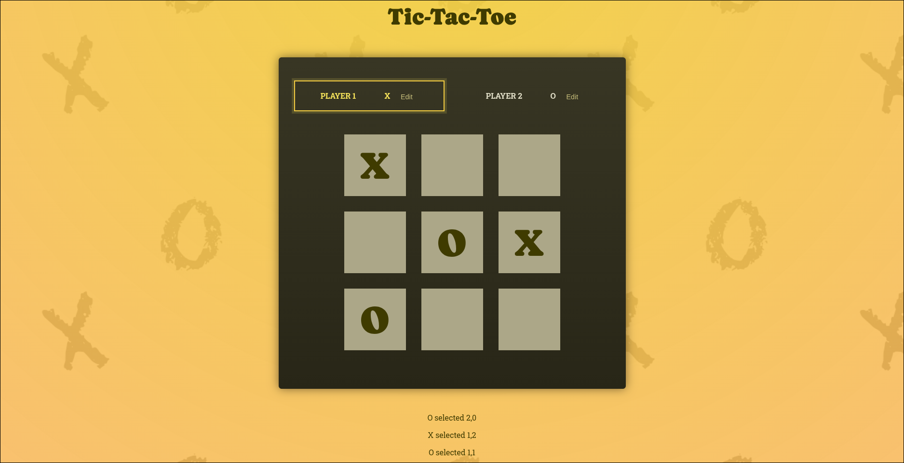

# Tic-Tac-Toe React ⚛️

A simple Tic-Tac-Toe game built with React. This project is a classic game for two players (❌ and ⭕), where each player takes turns marking a 3x3 grid. The player who succeeds in placing three of their marks in a horizontal, vertical, or diagonal row wins the game.

## Functionalities 🎮

* **Two-player gameplay** 🧑‍🤝‍🧑: Play against a friend on the same device.

* **Winning detection** 🏆: The game automatically detects when a player has won.

* **Draw detection** 🤝: The game will declare a draw if no player wins.

* **Move history** 📜: See a list of all the moves made in the game.

* **Reset game** 🔄: Start a new game at any time.

## Technologies Used 💻

* **JavaScript** 🟨

* **React** ⚛️

* **HTML** 🌐

* **CSS** 🎨

## How to Run 🚀

To run this project locally, you will need to have Node.js and npm installed on your machine.

1. **Clone the repository** 📥:

```

git clone [https://github.com/JamesIslan/tic-tac-toe-react.git](https://www.google.com/search?q=https://github.com/JamesIslan/tic-tac-toe-react.git)

```

2. **Navigate to the project directory** 📁:

```

cd tic-tac-toe-react

```

3. **Install the dependencies** 📦:

```

npm install

```

4. **Start the development server** ▶️:

```

npm start

```

The application will be available at `http://localhost:3000` 🔗.
